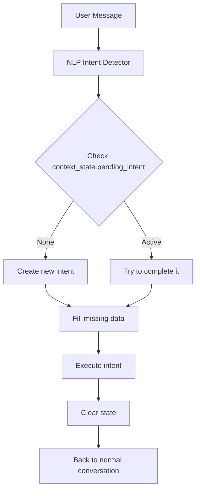

# Nexa Intent State System

This document describes the **instruction logic**, **structure**, and **data flow** for the dynamic Intent State system used in Nexa.

---

## 1. Purpose of Intent State

Nexa needs to handle follow-up questions and multi-turn actions.

> [!NOTE]
> These are just examples of follow-ups. Follow-up questions will not be limited to the specific scenarios mentioned below.

**Examples:**

*   **User:** "Launch an Application"
    *   **Nexa:** "Which application would you like me to open?"
*   **User:** "Play music"
    *   **Nexa:** "Which song do you want to play?"
    *   **User:** "Baby by Justin Bieber"
    *   **Nexa:** *Understands this is a continuation, not a new independent request.*

To achieve this, Nexa maintains a **dynamic context state** for each conversation.

---

## 2. Intent State File Structure

The file is stored as `intent_state.json` inside Nexa's memory directory.

### Structure

```json
{
  "conversation_history": [],
  "context_state": {
    "pending_intent": null,
    "data_needed": null,
    "collected_data": {}
  }
}
```

### Field Explanation

*   **`pending_intent`**
    The current active task waiting for a follow-up.
    *   Example: `"play_music"`

*   **`data_needed`**
    The required information to complete the pending intent.
    *   Example: `"song_name"`

*   **`collected_data`**
    Optional data already gathered from the user.
    *   Example:
        ```json
        {
          "song_name": "Baby by Justin Bieber"
        }
        ```

---

## 3. Intent Flow Overview

Below is the data and logic flow Nexa uses:

### Step 1: User gives a command
Example: `"Play music"`

### Step 2: NLP Intent Detection
The system identifies:
```json
{
  "intent": "play_music",
  "required_data": "song_name"
}
```

### Step 3: Intent State is updated
```json
"context_state": {
  "pending_intent": "play_music",
  "data_needed": "song_name",
  "collected_data": {}
}
```

### Step 4: Nexa asks for missing data
Output: **"Which song should I play?"**

### Step 5: User replies
Example: `"Baby by Justin Bieber"`

### Step 6: Follow-up Handler
Checks if the reply should complete an existing intent.

### Step 7: Execute Final Intent
After completing required data:
```json
"collected_data": {
  "song_name": "Baby by Justin Bieber"
}
```
Nexa executes: **`Play(song_name)`**

### Step 8: Clear Intent State
```json
"context_state": {
  "pending_intent": null,
  "data_needed": null,
  "collected_data": {}
}
```

---

## 4. Data Flow Diagram



---

## 5. Important Rules

*   A new command overrides an incomplete intent.
*   Intent state resets automatically after execution.
*   User can cancel: "Cancel that" → clears state.
*   Intent state is always saved back to JSON after each message.

---

## 6. File Maintenance

The file must be:
*   Updated after every user input.
*   Loaded on startup.
*   Auto-reset when corrupt or incomplete.

---

## 7. Example File After Music Request

```json
{
  "conversation_history": [
    "User: Play music",
    "Nexa: Sure, which song should I play?"
  ],
  "context_state": {
    "pending_intent": "play_music",
    "data_needed": "song_name",
    "collected_data": {}
  }
}
```

---

This file provides the complete explanation for implementing Nexa's dynamic intent-follow-up system.

---

## 8. Ordinal Resolution (List Follow-ups)

**Added:** January 1, 2026

Nexa supports ordinal references like "the first one", "the third one", "the last one" for any list command.

### How It Works

1. **User lists something:** "List my games", "Show my songs", "What apps are running?"
2. **Nexa stores the list** in `IntentState._last_list`
3. **User uses ordinal:** "Open the third one", "Play the second one"
4. **Nexa resolves ordinal** to actual item name

### Supported Ordinals

| Ordinal | Index |
|---------|-------|
| first, 1st | 0 |
| second, 2nd | 1 |
| third, 3rd | 2 |
| fourth, 4th | 3 |
| fifth, 5th | 4 |
| last | -1 |
| previous | -2 |

### Supported List Types

| List Command | Follow-up Example |
|--------------|-------------------|
| `list_games` | "Open the third one" |
| `list_music` | "Play the second one" |
| `get_running_applications` | "Close the last one" |
| `list_wifi_networks` | "Connect to the first one" |

### Data Storage Keys

The system checks these keys when syncing lists to `IntentState`:
- `games`, `songs`, `apps`, `applications`, `networks`, `files`, `items`, `list`, `results`

### Technical Flow

```
User: "List my games"
  ↓
Executor calls: list_games()
  ↓
context_manager.set_last_action('list_games', {'games': ['TEKKEN 8', 'Elden Ring', ...]})
  ↓
IntentState._last_list = ['TEKKEN 8', 'Elden Ring', ...]
  ↓
User: "Open the third one"
  ↓
get_last_list() → returns IntentState._last_list
  ↓
resolve_ordinal('third') → index 2 → 'Elden Ring'
  ↓
Nexa opens 'Elden Ring'
```
